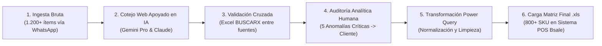

# Caso de Estudio 01: Pipeline ETL, Auditoría con `BUSCARX` y Migración a Sistema POS Bsale
**Empresa:** Librerías BigPEN (Santiago, Chile)  
**Rol:** Analista de Datos Operacionales (Proyecto Independiente)  
**Periodo:** Noviembre 2025 – Marzo 2026  
**Stack Técnico:** `Excel Avanzado` · `Power Query (ETL)` · `BUSCARX` · `SQL` · `Sistema POS Bsale (Formato .xls)` · `QA asistido por IA`

---

## 1. Resumen Ejecutivo del Problema
Librerías BigPEN operaba con más de **1.200 registros de productos** distribuidos en múltiples planillas Excel informales compartidas vía WhatsApp. La base presentaba:
* **Duplicidad de productos** con distintas descripciones.
* **Celdas nulas, espacios residuales y errores de tipado** que impedían la importación directa.
* **Errores críticos de identidad de SKU**, donde el código registrado en la planilla no correspondía al artículo físico real en tienda/bodega.

El objetivo fue diseñar y ejecutar un pipeline ETL auditable para migrar el 100% del catálogo válido al **Sistema POS (Punto de Venta, Control de Inventario y Facturación) Bsale** en el formato oficial **`.xls`**.

---

## 2. Arquitectura del Pipeline de Datos



---

## 3. Fórmulas y Lógica Aplicada en Excel & Power Query

### A. Validación Cruzada entre Fuentes con `BUSCARX`
Para evitar depender ciegamente de una sola fuente, se cruzaron los códigos obtenidos y la base original del cliente con la siguiente estructura lógica:

```excel
=SI(
  BUSCARX(A2; Tabla_Gemini[Producto]; Tabla_Gemini[SKU]; "NO_ENCONTRADO") = 
  BUSCARX(A2; Tabla_Claude[Producto]; Tabla_Claude[SKU]; "NO_CONSISTENTE");
  SI(
    B2 = BUSCARX(A2; Tabla_Gemini[Producto]; Tabla_Gemini[SKU]);
    "OK - VALIDADO";
    "ALERTA CRÍTICA: DISCREPANCIA CON SKU CLIENTE"
  );
  "REVISIÓN MANUAL"
)
```
* **Resultado de la Auditoría:** Este filtro aisló **5 productos con errores críticos en el código SKU**. Se presentó la evidencia al cliente por WhatsApp, confirmando que el código histórico estaba mal asignado y autorizando su rectificación antes de cargar el sistema.

### B. Normalización ETL en Power Query (Lenguaje M)
```powerquery
let
    Origen = Excel.CurrentWorkbook(){[Name="Tabla_Catalogo_Validado"]}[Content],
    TextoLimpio = Table.TransformColumns(Origen, {
        {"Nombre_Producto", each Text.Trim(Text.Clean(_)), type text},
        {"SKU_Final", each Text.Upper(Text.Trim(_)), type text}
    }),
    SinNulos = Table.SelectRows(TextoLimpio, each [SKU_Final] <> null and [SKU_Final] <> ""),
    SinDuplicados = Table.Distinct(SinNulos, {"SKU_Final"}),
    TiposDefinidos = Table.TransformColumnTypes(SinDuplicados, {
        {"Stock_Inicial", Int64.Type},
        {"Costo_Neto", Currency.Type},
        {"Precio_Venta", Currency.Type}
    })
in
    TiposDefinidos
```

---

## 4. Enriquecimiento de Catálogo Web e Indexación de Imágenes (`SKU_1`, `SKU_2`... hasta `SKU_8`)
Además de la validación de códigos, se preparó el catálogo completo para operar tanto en punto de venta físico como en el canal web/e-commerce de **Bsale**:
1. **Corrección y Estandarización de Títulos:** Normalización de los nombres comerciales asociados a cada SKU ya validado y cruzado con `BUSCARX`.
2. **Creación de Descripciones Web Completas:** Se redactaron e insertaron fichas descriptivas completas para cada uno de los 800+ productos dentro de la plantilla Excel de importación de Bsale.
3. **Búsqueda y Vinculación Masiva de Fotografías por SKU (`1.600+ imágenes`):**
   * Búsqueda de imágenes de producto apoyada en IA y descarga supervisada.
   * Inserción de **mínimo 2 imágenes por producto** (con soporte de hasta **máximo 8 imágenes** por artículo según el estándar de Bsale).
   * Renombrado y estructuración bajo la convención estricta de importación de Bsale: **`SKU_1`, `SKU_2`, `SKU_3`... hasta `SKU_8`** (ej. `071641300019_1.jpg`, `071641300019_2.jpg`).

---

## 5. Resultados e Impacto Operacional
| Indicador (KPI) | Resultado Obtenido |
| :--- | :--- |
| **Volumen Bruto Procesado** | +1.200 registros no estructurados |
| **Catálogo Maestro Final Migrado** | **800+ SKU únicos validados** (Títulos corregidos + Descripciones Web) |
| **Activos Digitales Vinculados** | **1.600+ imágenes indexadas** (Mínimo 2 por producto: `SKU_1`, `SKU_2`... máx. `SKU_8`) |
| **Velocidad de Procesamiento ETL** | **100 productos por hora** |
| **Anomalías Críticas Corregidas en Preventa** | **5 SKUs erróneos consultados por WhatsApp y rectificados con el cliente** |
| **Pérdida de Información en Producción** | **0% (Trazabilidad total desde el Día 1 en Bsale POS)** |
