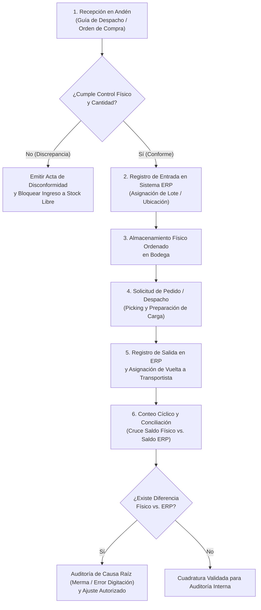

# Caso de Estudio 02: Automatización de Liquidaciones Logísticas, Diseño BPM y Conciliación ERP
**Empresa:** Ambientes Limpios S.A. (Santiago, Chile)  
**Rol:** Asistente de Control de Inventarios (Práctica Profesional)  
**Periodo:** Enero 2023 – Junio 2023  
**Stack Técnico:** `Excel Avanzado (Modelado Condicional)` · `BPM / Diagramación de Procesos` · `Conciliación Físico-Contable ERP` · `Auditoría de Mermas`

---

## 1. Contexto y Desafíos Operacionales
En el área de bodega y operaciones logísticas de **Ambientes Limpios S.A.** se identificaron tres puntos críticos de control:
1. **Riesgo en Liquidación de Transporte:** El pago mensual a transportistas se calculaba de forma manual según la cantidad de vueltas diarias realizadas, generando demoras administrativas y riesgo de errores en la cuadratura presupuestaria.
2. **Brecha Documental para Auditoría:** No existía un diagrama de flujo operacional formal y validado que estandarizara las etapas de recepción, almacenamiento, control y despacho de bodega ante auditorías internas.
3. **Desviaciones de Stock (Físico vs. ERP):** Diferencias entre las existencias físicas en estantería y los registros contables del **sistema ERP corporativo**.

---

## 2. Solución 1: Control de Horarios de Salida/Vuelta y Liquidación a Transportistas (Excel)

Los camiones realizaban únicamente **1 o 2 vueltas al día** (nunca más de 2). Diseñé una planilla en Excel donde registraba la **hora exacta de salida y de vuelta** de cada camión y automatizaba el cálculo del pago con fórmulas condicionales:
* **1 vuelta al día:** El camión salía en la mañana y regresaba generalmente entre las **12:00 y 14:00 hrs** → Pago asignado automáticamente: **`$25.000`**.
* **2 vueltas al día:** El camión hacía una segunda vuelta regresando aproximadamente entre las **16:00 y 17:00 hrs** → Pago asignado automáticamente: **`$55.000`**.

### Lógica de Cálculo Condicional Implementada
```excel
=SI(
  [@[Total_Vueltas_Dia]] = 1; 
  25000; 
  SI(
    [@[Total_Vueltas_Dia]] = 2; 
    55000; 
    0
  )
)
```
* **Cuadratura y Liberación de Pagos:** Toda esta planilla se cuadraba contra los **archivos y respaldos impresos** para que el jefe los firmara y así se pudieran liberar los pagos mensuales sin errores ni cálculos manuales.

---

## 3. Solución 2: Diagrama de Flujo Operacional de Bodega (BPM para Auditoría Interna)

A solicitud directa del **Gerente de Procesos**, se realizó el levantamiento en terreno de punta a punta y se diseñó el flujo oficial de control de bodega, el cual fue **felicitado por jefatura y validado como insumo técnico oficial para auditorías internas**.



---

## 4. Solución 3: Conteos Cíclicos y Conciliación contra Sistema ERP
* Ejecución periódica de inventarios selectivos (conteos cíclicos) sobre familias de alta rotación.
* Cruce sistemático entre el kárdex de entradas/salidas del **sistema ERP** y el conteo físico en terreno para aislar errores de imputación y controlar mermas operativas.
